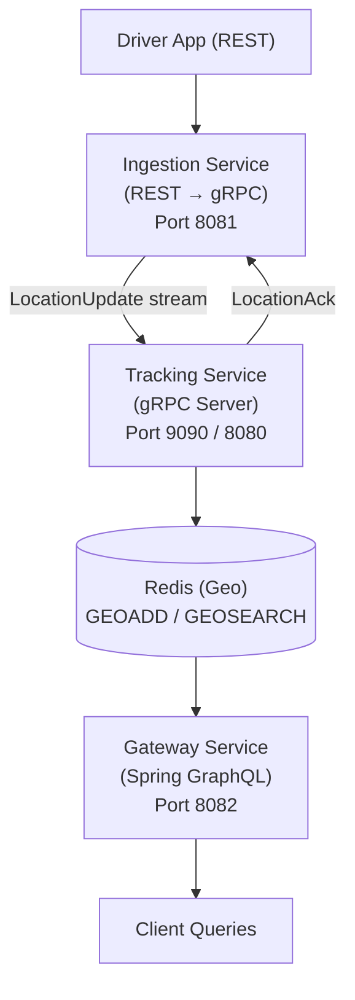

# Convoy — Real-Time Fleet Tracking Platform

A distributed, real-time fleet/delivery tracking system built to demonstrate production-grade backend architecture: gRPC streaming, GraphQL, geospatial data, and full observability — all in pure Java.

Built from scratch as a learning project to go beyond REST-only CRUD apps and into the patterns real logistics/ride-share platforms (Uber, DoorDash) actually run in production.

## Architecture



**Three independent Spring Boot services:**

| Service | Responsibility | Protocol | Port |
|---|---|---|---|
| **Ingestion Service** | Public-facing entry point for driver apps | REST | 8081 |
| **Tracking Service** | Receives high-frequency location pings, persists to Redis | gRPC (client-streaming) | 9090 |
| **Gateway Service** | Flexible querying of live driver locations | GraphQL | 8082 |

Plus **Redis** (geospatial store, hosted on Layerbase) and a **Prometheus + Grafana** observability stack.

## Why these technology choices

**gRPC over REST for Ingestion → Tracking:** location pings are high-frequency and continuous. REST would mean a new HTTP request, full headers, and JSON parsing overhead per ping. gRPC's client-streaming keeps one persistent HTTP/2 connection open and pushes many small binary (Protobuf) messages through it — the right fit for this traffic pattern. REST stays at the public edge (Ingestion Service) because compatibility with arbitrary driver-app clients matters more there than raw throughput.

**GraphQL over REST for the Gateway:** different clients need different shapes of driver data (a dashboard wants full details, a map view wants only coordinates). REST would mean either over-fetching or an endpoint-per-use-case explosion. GraphQL exposes one endpoint and lets each client ask for exactly the fields it needs.

**Redis for location storage, not a relational database:** driver locations are ephemeral — only the *current* position matters for live tracking, not history. Redis's in-memory speed and native geospatial commands (`GEOADD`/`GEOSEARCH`) make "find drivers within X km" a single fast command instead of a manual distance calculation across rows.

**Timestamp-based conflict resolution:** pings can arrive out of order (network jitter, retries). Each write checks the incoming timestamp against the currently stored one and only overwrites if newer — preventing a stale, late-arriving ping from clobbering a more recent position.

## Tech stack

Java 25 · Spring Boot 4 · gRPC + Protobuf · Spring GraphQL · Redis (geospatial) · Docker (multi-stage builds) · Docker Compose · Prometheus · Grafana

## Running it

```bash
git clone <this-repo>
cd convoy
docker-compose up --build
```

Requires a `.env`/environment with `REDIS_PASSWORD` and `REDIS_HOST` set (Redis is externally hosted, not included in the compose stack).

Once running:
- Ingestion Service: `http://localhost:8081/api/locations` (POST)
- Gateway Service (GraphQL): `http://localhost:8082/graphql`
- Prometheus: `http://localhost:9091`
- Grafana: `http://localhost:3000`

### Send a test ping
```bash
curl -X POST http://localhost:8081/api/locations \
  -H "Content-Type: application/json" \
  -d '{"driverId":"driver-1","latitude":6.9271,"longitude":79.8612}'
```

### Query it back
```graphql
query {
  driver(id: "driver-1") {
    id
    latitude
    longitude
  }
}
```

or find nearby drivers:
```graphql
query {
  driversNearby(latitude: 6.9271, longitude: 79.8612, radiusKm: 5) {
    id
    latitude
    longitude
    distance
  }
}
```

## Observability

Each service exposes Micrometer metrics via Spring Actuator (`/actuator/prometheus`), scraped by Prometheus every 15s. Grafana dashboards track:
- JVM thread counts per service (leak detection)
- Heap memory usage per service
- HTTP request rate

## Notable engineering problems solved

- **Alpine/glibc incompatibility:** `protoc`/`protoc-gen-grpc-java` binaries are compiled for glibc and silently fail on Alpine's musl libc during Docker builds. Fixed by using a non-Alpine JDK image for the Maven build stage, while keeping Alpine JRE for the smaller runtime image.
- **Docker service discovery:** `host.docker.internal` only resolves the host machine, not sibling containers — Prometheus targets and inter-service gRPC calls needed to reference Docker Compose service names instead.
- **Load tested** with 100 concurrent REST requests to confirm the REST → gRPC → Redis pipeline holds up under concurrent load.

## Roadmap

- [ ] Kubernetes manifests as a Docker Compose alternative
- [ ] Historical location tracking (separate from live-only Redis store)
- [ ] Auth/rate-limiting at the Ingestion edge
